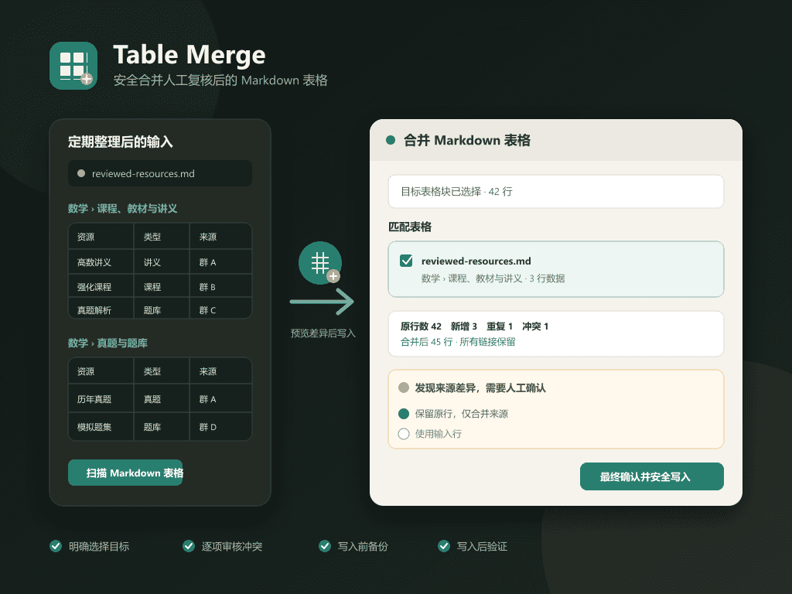

# Table Merge

[简体中文](README.zh-CN.md)

> **Maintenance status and recommended alternative**
>
> This plugin is now maintained primarily for the author's own workflow and
> essential fixes. For general table features such as smart paste, row and
> column movement, sorting, transposition, width adjustment, calculations, and
> charts, prefer
> [Table Master](https://github.com/famotime/siyuan-table-master).
>
> Continue using this plugin only when you need same-schema resource-table
> deduplication, conflict review, pre-write backups, and post-write validation.

Safely merge reviewed Markdown tables into an existing SiYuan table selected
by the user.



> Note: The preview is an AI-assisted functional illustration and differs
> from the actual plugin interface. Please refer to the running plugin.

## Motivation

SiYuan stores standard tables as Markdown tables. My recurring workflow is to
have AI organize and clean a batch of resources into Markdown, review the
result, and periodically merge those rows into tables already maintained in
SiYuan.

Manual copy and paste makes it easy to miss duplicate links, same-name
resources with different links, changed access codes, and provenance updates.
Documents can also contain several sections—such as courses and past
papers—that deliberately use the same header. SiYuan databases can store
links, but standard Markdown hyperlinks are more convenient for this
AI-assisted, portable, copy-friendly workflow.

Table Merge handles only the final step: merging already reviewed Markdown
tables into an existing table with an explicit preview, manual conflict
choices, a backup, and post-write verification.

## Positioning

This plugin primarily supports the author's own workflow for structured
resource tables. It is particularly useful for incrementally merging and
deduplicating Baidu Netdisk, Quark Drive, and similar link tables while
reviewing provenance or access-code changes.

It is not a general table-layout tool and does not manage merged cells,
navigation-style categories, or visual beautification. Curated presentation
tables that rely on merged cells and intentional whitespace are better
arranged manually in SiYuan.

## Features

- Explicitly select one target table block; the plugin never guesses a note or
  destination.
- Open the plugin on the target table and immediately render pasted content as
  a source-column table with selectable data rows.
- Treat the first pasted row as the source header by default and select every
  row after it; allow the first row to be included when it is actual data.
- Skip mapping for equal headers and reorder automatically only when the same
  unique header names appear in a different order.
- Paste a complete Markdown table, row-only Markdown/TSV, or read a local
  `.md` file.
- Require an explicit one-to-one target-column mapping confirmation for
  headerless rows; equal column counts never approve a transfer by themselves.
- Recover standard and SiYuan rich-text links from HTML clipboard data when
  rows are copied directly from a SiYuan table.
- Recover Markdown links from SiYuan rich clipboard HTML so multi-row copying
  does not silently degrade links to plain text.
- For multi-table files, show the source filename, Markdown heading path, line
  range, header, and first two rows.
- Disable tables whose headers do not match the target.
- Separate additions, exact duplicates, same or normalized-name notices, and
  link conflicts.
- Identify Baidu and Quark shares by platform and share ID.
- Preserve same-name/different-link resources and cross-platform mirrors.
- Resolve each conflict by keeping the original row, using the incoming row,
  or keeping the original row while merging only its source/provenance cell.
- Re-read and back up the target before writing, then verify the header, row
  count, order, contents, and links after writing.
- Keep all table data local; no external AI or link-checking service is used.

## Quick row transfer

1. Explicitly select the target table in SiYuan and click the top-bar icon.
2. Paste the copied table content into the existing input box. A column-aligned
   row picker appears immediately in the same dialog.
3. By default, the first row is the source header and every later row is
   selected. Use the master checkbox or individual row checkboxes to adjust
   the selection. Disable the header option if the first row is data.
4. Generate the preview. Equal headers pass automatically, and the same unique
   headers in a different order are reordered. Only real mismatches require
   manual mapping.
5. Review additions, duplicates, notices, and conflicts, then perform the final
   write.

For the first test, use a copied table in a disposable document rather than
the only copy of important data.

## Complete Markdown and local files

The same dialog also accepts complete Markdown tables, pipe/TSV rows, and
local `.md` files. Multi-table selection continues to use source names,
heading paths, and strict header checks.

## Input and mapping

A complete input table must have the same column count and header as the
target. One or more data rows may also be pasted without a header. Because
their source table cannot be proven, the plugin shows each source column, cell
samples, and target-header choice. The default order is only a suggestion:
every mapping must be reviewed and explicitly confirmed. Mappings must be
one-to-one, without missing or duplicate target columns, and widths must match.
When rows are copied directly from SiYuan, the plugin first tries to recover
standard `<a>` and SiYuan `data-href` links from the HTML clipboard. A URL
cannot be reconstructed if the clipboard source itself supplies only plain
text.

```markdown
| Resource | Type | Platform / Status | Source |
| --- | --- | --- | --- |
| [Example notes](https://example.com/a) | Notes | Web / ✅ | Reviewed |
```

A file may contain prose, headings, and several tables with different headers.
Only recognized tables can be selected. Paragraphs and images outside tables
are never written into the target table.

## Merge rules

| Case | Default behavior |
| --- | --- |
| Exact row duplicate | Skip |
| New link | Append |
| Same name, different link | Keep both and show a notice |
| Same Baidu/Quark share ID with other changes | Require a conflict choice |
| Different query strings on ordinary URLs | Treat as different links |
| Rows without links | Deduplicate only when the entire row matches |
| Header mismatch | Block selection and writing |

A trailing decoration such as a platform and shortened share ID is ignored
only for normalized-name notices. It is never used as a deduplication or
overwrite key.

## Write safety

- Previewing never writes to the note.
- The SiYuan Kernel API is called only after final confirmation.
- The target is read again before writing; a changed table invalidates the
  preview.
- The latest original Kramdown is backed up through SiYuan's plugin data API.
- Only one write may run for a target block at a time.
- The result is read back and verified after writing.
- SiYuan Kramdown IAL metadata is preserved and excluded from data-row
  matching.

## Scope

- Windows desktop only.
- One explicitly selected standard Markdown table block.
- No AI invocation, chat-log cleaning, content classification, or link
  availability checking.
- No automatic choice between same-header sections.
- No direct `.sy` file editing and no external upload of table data.

## Installation

Install from the SiYuan Bazaar when available. For local installation, see
[README-install.zh-CN.md](README-install.zh-CN.md).

## Development

```powershell
npm ci
npm run check
npm test
npm run build
npm run package
```

Source lives in `src/`. `dist/`, `release/`, and `package.zip` are generated.

## Reporting issues

There is no separate promotional post for Table Merge. To report a problem,
reply to the “Table Merge / 表格合并” feedback thread under the
[Auto Favicon community post](https://ld246.com/article/1785052610863).

Remove private links, access codes, note content, block IDs, and workspace
paths before posting public reports. See [SECURITY.md](SECURITY.md) and
[CONTRIBUTING.md](CONTRIBUTING.md).

## License

[MIT License](LICENSE)
